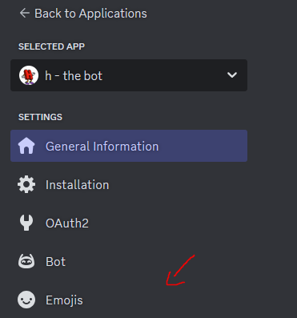
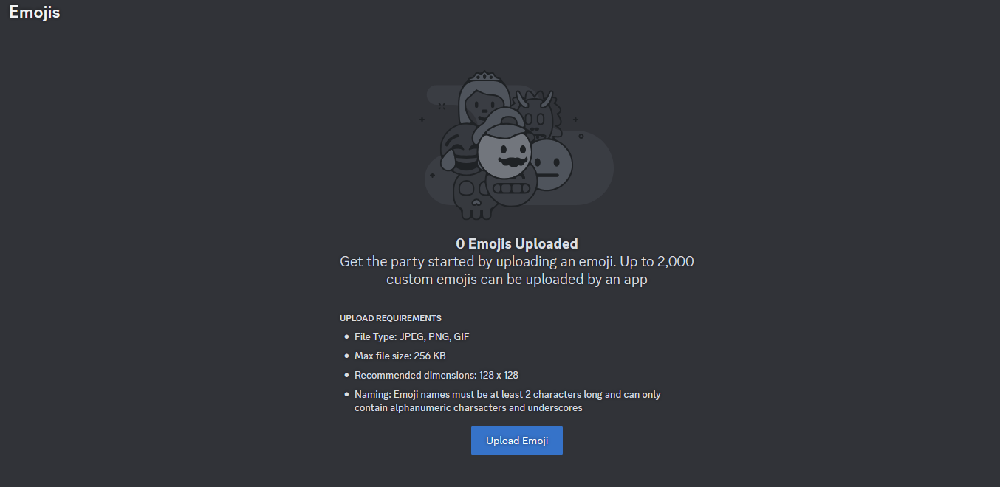

# hbot-discord
https://discord.gg/bNeQwCBb

https://discord.com/oauth2/authorize?client_id=1272230120521732107

h


<!-- install nodejs, clone the repo and run ```npm install discord.js better-sqlite3 lyntr.js``` -->
install nodejs, clone the repo and run ```npm install discord.js better-sqlite3 pm2```

create a discord application on discord.com/developers

make sure the bot has the
1. send messages
2. send messages in threads
3. view channels
permissions, and also give the bot command permissions

make yourself (or use a different testing server owned by you) a testing server and invite you and the h bot bot into the server

edit the configEXAMPLE.json file.
token is your bot's token.
guildId is the id of your bot's testing server.
clientId is the application id of your bot.
hfactsChannelID is the id of the channel in your testing server where the bot will send user submissions for h facts. anyone can accept or decline the facts, so be sure to limit the channel to specific people!

once you are done with editing the file, rename it to config.json
<!-- shelved feature for now. will come back soon
# lyntr.js functionallity

if you want to use lyntr.js with your server, here's what to do
-->

run the bot either with run.bat, or with either pm2 or nodejs

nodejs:

```
node deploy-commands.js
node index.js
```

pm2:

```
node deploy-commands.js
pm2 start index.js
```

if you want to kill the bot in pm2 just run ``` pm2 kill ```

# emojis
if you want the emojis of the bot to work, follow my steps

1. go to your bot's application.
2. go to the "emojis tab"


3. you will see this page


4. you want to upload all the images from the "images/dancingletters" and the "images/emojis" folder into this page. do NOT rename the emojis!
5. go to the modules/emojiids.js file and find the emojiids table. replace every id from the table with the id from the emoji tab. so, for example you wanted to replace the letter h's emoji id. you would go into the emoji tab of your application, find the letter h emoji and then copy the emoji id. then in the table, find the letter h and replace the id with the id from your application's emoji tab.
6. once you did all of that, once you try the dancingwords command, it should work!

i know this is tedious, but im not the best coder in the world. sorry :/
